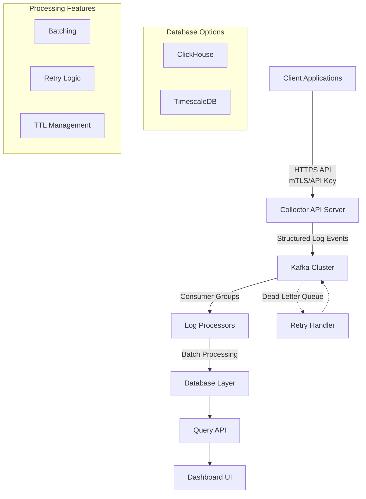

# 🚀 Instant Dev Logs - Production-Grade Architecture

> A distributed logging platform designed for enterprise-scale applications, featuring real-time processing, ad---

## 🚀 Why This Project Stands Out

> *"Instead of building just another CRUD application, I developed a comprehensive microservice-based distributed system featuring log ingestion, message queuing, batch processing, advanced querying, and real-time analytics. This platform mirrors the architecture and capabilities of industry-leading tools like Datadog and ELK Stack, built entirely from the ground up with production-grade reliability and scalability."*

### Interview-Ready Talking Points

1. **Scalability**: Demonstrates understanding of horizontal scaling patterns
2. **Reliability**: Shows implementation of fault-tolerant distributed systems
3. **Performance**: Optimized for high-throughput, low-latency processing
4. **Security**: Enterprise-grade authentication and authorization
5. **Observability**: Comprehensive monitoring and alerting capabilities

---

## 📊 Performance Characteristics

| Metric | Target | Implementation |
|--------|--------|----------------|
| **Throughput** | 100K+ logs/second | Kafka partitioning + parallel consumers |
| **Latency** | < 100ms end-to-end | Optimized batch processing |
| **Availability** | 99.9% uptime | Redundant components + health checks |
| **Retention** | Configurable | Automated data lifecycle management |

---

## 📄 Resume Bullet Point

*Ready-to-use professional summary for your resume:*

> **Built "Instant Dev Logs"** – a distributed logging system with log ingestion, queuing, processing, and query engine. Designed a microservice architecture using Node.js, Apache Kafka, and TimescaleDB/ClickHouse. Developed custom log filters (time range, app, level), batch processing with retry logic, and comprehensive monitoring tools to ensure system reliability under enterprise-scale loads.

---

*Built with ❤️ for production environments and technical excellence.*

---

## 🏗️ System Architecture

The following diagram illustrates the complete data flow from log generation to visualization:



### ASCII Architecture Diagram

```
         ┌────────────┐
         │  Client    │
         │(App Logs)  │
         └────┬───────┘
              │
        HTTPS API (secured with mTLS / API key)
              │
       ┌──────▼──────┐
       │  Collector  │
       │  API Server │
       └────┬───────▲┘
            │Log Events (structured)
            ▼
     ┌───────────────┐
     │ Kafka Cluster │◄────┐
     └────┬────▲─────┘     │ (Retry / Dead-letter queue)
          │    │           │
     ┌────▼────┴─────┐     │
     │  Processor(s) │─────┘
     │(Consumer Group)│ (Batching + Retry + TTL)
     └────┬──────────┘
          ▼
   ┌───────────────┐
   │  ClickHouse / │
   │  TimescaleDB  │
   └──────┬────────┘
          │
    ┌─────▼─────┐
    │ Query API │───────► Filters: time range, level, app, etc.
    └─────┬─────┘
          │
    ┌─────▼─────┐
    │ Dashboard │ (React + WebSocket tailing + analytics)
    └───────────┘
```

---
## 📋 Project Overview

### 🎯 Goal

Build a production-grade distributed logging platform similar to **Datadog Logs** or **ELK Stack**, designed to handle enterprise-scale log processing with real-time analytics.

---

## ✨ Key Features

| Feature | Description |
|---------|-------------|
| 🔒 **Secure Ingestion** | Collects structured logs from multiple apps via secure HTTP API |
| ⚡ **Scalable Processing** | Uses Kafka for scalable, durable log ingestion |
| 🔄 **Batch Processing** | Processes logs with consumer group workers for optimal performance |
| 💾 **High-Performance Storage** | Stores logs in analytical databases (TimescaleDB or ClickHouse) |
| 🔍 **Advanced Querying** | Offers filtering, querying, and optional analytics dashboard |
| 🛡️ **Fault Tolerance** | Supports backpressure, retries, and dead-letter queues |
| 🏗️ **Microservice Design** | Built with clean separation of concerns and scalability in mind |

---

## 🛠️ Technology Stack

| Layer | Technology | Description |
|-------|------------|-------------|
| **Collector API** | Node.js / Go / Python | Secure ingestion with mTLS / API key authentication |
| **Message Queue** | Apache Kafka | Partitioned, durable, and horizontally scalable |
| **Processors** | Go / Python | Batch workers using consumer groups |
| **Database** | TimescaleDB / ClickHouse | High-performance time-series and analytical storage |
| **Query Service** | Node.js / Go API | Custom filtering and query capabilities |
| **Dashboard** | React + WebSocket | Real-time UI with Chart.js visualizations |
| **Deployment** | Docker + Kubernetes | Container orchestration with Prometheus metrics |

---

## 🔐 Production Considerations

### Security
- **Authentication**: mTLS or API keys for secure log ingestion
- **Authorization**: Role-Based Access Control (RBAC) for query operations
- **Encryption**: End-to-end encryption for data in transit and at rest

### Observability
- **Monitoring**: Prometheus + Grafana for comprehensive system metrics
- **Alerting**: Real-time alerts for system health and performance
- **Logging**: Structured logging for troubleshooting and audit trails

### Fault Tolerance
- **Retry Mechanisms**: Intelligent retry logic with exponential backoff
- **Dead Letter Queues**: Isolation of problematic messages for analysis
- **Batching**: Efficient processing to handle high-volume scenarios

### Scalability
- **Horizontal Scaling**: Kafka partitions enable linear scalability
- **Consumer Groups**: Multiple processor instances for load distribution
- **Database Sharding**: Distributed storage for massive data volumes

---

## 🎯 Technical Demonstrations

This project showcases several critical backend engineering skills:

### 🏗️ **System Architecture & Design**

- Microservice-based distributed system design
- Event-driven architecture with proper decoupling
- Scalable data pipeline implementation

### ⚡ **Real-time Data Processing**

- Stream processing with Apache Kafka
- Consumer group management and load balancing
- Backpressure handling and flow control

### 🔍 **Query Engine Design**

- Efficient querying over large time-series datasets
- Custom filtering and aggregation capabilities
- Optimized data retrieval patterns

### ⚖️ **Engineering Trade-offs**

- Balancing durability, performance, and system complexity
- CAP theorem considerations in distributed systems
- Cost vs. performance optimization strategies

### 🧩 **Production-Ready Patterns**

- Clean microservice separation and boundaries
- Comprehensive error handling and recovery
- Monitoring, alerting, and operational excellence

🧠 Why It’s Interview-Ready:
“Instead of building just a CRUD app, I built a microservice-based distributed system — with log ingestion, queuing, batching, querying, and analytics. It mimics real industry tools like Datadog, but built from the ground up."


# 📄 Resume Bullet Point (Ready-to-Use)
## Here’s a bullet point you can copy/paste into your resume:

- Built “Instant Dev Logs” – a distributed logging system with log ingestion, queuing, processing, and query engine. Designed a microservice architecture using Node.js, Redis Streams, and PostgreSQL. Developed custom log filters (time range, app, level), batch processing with retry logic, and local simulation tools to test system behavior under real-world load.